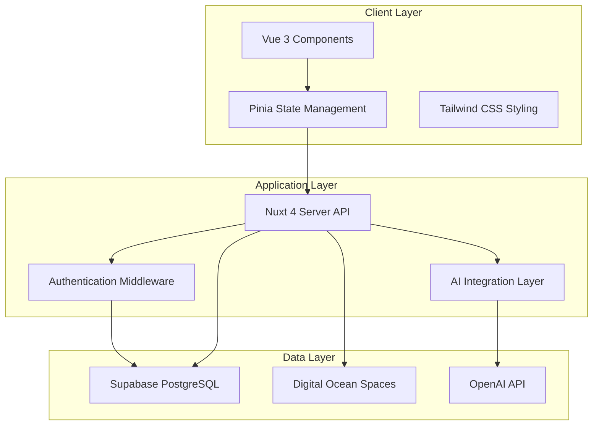

# Design Document

## Overview

JobSearchSage is architected as a modern full-stack web application using Nuxt 4 with server-side rendering capabilities. The system follows a component-based architecture with clear separation between presentation, business logic, and data layers. The design emphasizes real-time collaboration, AI integration, and scalable data management to support systematic job search workflows.

**Note:** The Nuxt 4 project structure has already been initialized and is ready for implementation. The following design reflects the architecture that will be built upon this existing foundation.

## Architecture

### High-Level Architecture



### Technology Stack Integration

- **Frontend**: Nuxt 4 with Vue 3 Composition API for reactive components
- **Backend**: Nuxt 4 server directory with API routes for business logic and external integrations
- **Database**: Supabase PostgreSQL with real-time subscriptions
- **Authentication**: Supabase Auth with row-level security
- **AI Services**: OpenAI GPT-4 API for content generation and coaching
- **File Storage**: Digital Ocean Spaces for resume and document storage
- **Hosting**: Digital Ocean App Platform with auto-scaling

### Existing Nuxt 4 Project Structure

The project has been initialized with Nuxt 4 and includes the following structure:

```
job-search-sage/
├── app/                   # Nuxt 4 app directory (client-side only)
│   ├── components/       # Vue components (ready for implementation)
│   ├── layouts/          # Layout components
│   ├── pages/            # File-based routing pages
│   ├── stores/          # Pinia state management (to be created)
│   └── app.vue          # Root application component
├── server/              # Server-side code (root level)
│   ├── api/             # API endpoints (to be created)
│   └── middleware/      # Server middleware (to be created)
├── public/              # Static assets (favicon, robots.txt)
├── nuxt.config.ts       # Nuxt configuration
├── package.json         # Dependencies and scripts
└── tsconfig.json        # TypeScript configuration
```

**Current Setup Status:**

- ✅ Nuxt 4 project initialized with Vue 3 and TypeScript
- ✅ Correct directory structure with server/ at root level
- ✅ Client-side app/ directory properly separated
- ✅ Development environment ready
- 🔄 Ready for component and API implementation

## Components and Interfaces

### Core Components

#### Authentication System

- **LoginForm.vue**: Email/password authentication with Supabase
- **RegisterForm.vue**: User registration with validation
- **OnboardingWizard.vue**: Multi-step onboarding flow
- **ProfileManager.vue**: Account settings and preferences

#### Resume & Cover Letter Engine

- **ResumeUploader.vue**: File upload with validation (PDF/Word)
- **JobUrlParser.vue**: URL input and job posting extraction
- **DocumentTailor.vue**: AI-powered resume/cover letter generation
- **DocumentComparison.vue**: Side-by-side original vs tailored view
- **ATSAnalyzer.vue**: Keyword matching and optimization scoring
- **DocumentDownloader.vue**: PDF/Word export functionality

#### Job Pipeline Tracker

- **PipelineBoard.vue**: Drag-and-drop Kanban-style interface
- **JobCard.vue**: Individual job application cards with status
- **MetricsDashboard.vue**: Application metrics and conversion rates
- **TimelineVisualization.vue**: Visual timeline of job search activity
- **FollowUpReminders.vue**: Notification system for timing-based follow-ups
- **JobNotes.vue**: Communication history and notes management

#### Communication Templates

- **TemplateLibrary.vue**: Professional email and message templates
- **MessageComposer.vue**: AI-assisted communication generation
- **FollowUpScheduler.vue**: Strategic timing for communications
- **LinkedInIntegration.vue**: Professional networking message generation
- **SalaryNegotiation.vue**: Conversation frameworks and templates

#### SageAI Coach

- **ChatInterface.vue**: Conversational AI coaching interface
- **RecommendationEngine.vue**: Personalized strategy suggestions
- **PerformanceAnalyzer.vue**: Pipeline metrics analysis and insights
- **StrategyGuide.vue**: Methodology-based guidance system

### API Interfaces

#### Authentication Endpoints

```typescript
// /api/auth/register
POST /api/auth/register
Body: { email: string, password: string, profile: UserProfile }
Response: { user: User, session: Session }

// /api/auth/login
POST /api/auth/login
Body: { email: string, password: string }
Response: { user: User, session: Session }
```

#### Resume Management Endpoints

```typescript
// /api/resumes/upload
POST /api/resumes/upload
Body: FormData with resume file
Response: { resumeId: string, url: string }

// /api/resumes/tailor
POST /api/resumes/tailor
Body: { resumeId: string, jobUrl: string, jobDescription: string }
Response: { tailoredResume: string, changes: Change[], atsScore: number }
```

#### Job Pipeline Endpoints

```typescript
// /api/jobs
GET /api/jobs
Response: { jobs: Job[], metrics: PipelineMetrics }

POST /api/jobs
Body: { company: string, role: string, status: JobStatus, notes?: string }
Response: { job: Job }

PUT /api/jobs/:id
Body: { status?: JobStatus, notes?: string }
Response: { job: Job }
```

#### AI Integration Endpoints

```typescript
// /api/ai/generate-cover-letter
POST /api/ai/generate-cover-letter
Body: { resumeId: string, jobDescription: string, companyInfo: string }
Response: { coverLetter: string, personalizationPoints: string[] }

// /api/ai/chat
POST /api/ai/chat
Body: { message: string, context: UserContext }
Response: { response: string, suggestions: string[] }
```

## Data Models

### User Management

```typescript
interface User {
  id: string;
  email: string;
  profile: UserProfile;
  createdAt: Date;
  updatedAt: Date;
}

interface UserProfile {
  firstName: string;
  lastName: string;
  targetRole?: string;
  targetIndustry?: string;
  experienceLevel: 'entry' | 'mid' | 'senior' | 'executive';
  jobSearchGoals: string[];
  preferences: UserPreferences;
}

interface UserPreferences {
  emailNotifications: boolean;
  followUpReminders: boolean;
  weeklyReports: boolean;
  aiCoachingStyle: 'supportive' | 'direct' | 'analytical';
}
```

### Resume & Document Management

```typescript
interface Resume {
  id: string;
  userId: string;
  fileName: string;
  fileUrl: string;
  content: string;
  isBase: boolean;
  createdAt: Date;
  updatedAt: Date;
}

interface TailoredDocument {
  id: string;
  userId: string;
  baseResumeId: string;
  jobId?: string;
  type: 'resume' | 'cover_letter';
  content: string;
  changes: DocumentChange[];
  atsScore: number;
  keywords: string[];
  createdAt: Date;
}

interface DocumentChange {
  type: 'addition' | 'modification' | 'removal';
  section: string;
  original?: string;
  modified: string;
  reason: string;
}
```

### Job Pipeline Management

```typescript
interface Job {
  id: string;
  userId: string;
  company: string;
  role: string;
  jobUrl?: string;
  description?: string;
  status: JobStatus;
  appliedDate?: Date;
  lastContactDate?: Date;
  nextFollowUpDate?: Date;
  notes: JobNote[];
  communications: Communication[];
  createdAt: Date;
  updatedAt: Date;
}

type JobStatus =
  | 'researched'
  | 'applied'
  | 'phone_screen'
  | 'interview'
  | 'final_round'
  | 'offer'
  | 'rejected'
  | 'withdrawn';

interface JobNote {
  id: string;
  content: string;
  type: 'general' | 'interview' | 'research' | 'follow_up';
  createdAt: Date;
}

interface Communication {
  id: string;
  type: 'email' | 'phone' | 'linkedin' | 'in_person';
  direction: 'sent' | 'received';
  subject?: string;
  content: string;
  contactPerson?: string;
  scheduledDate?: Date;
  completedDate?: Date;
  createdAt: Date;
}
```

### AI & Analytics

```typescript
interface PipelineMetrics {
  totalApplications: number;
  responseRate: number;
  interviewRate: number;
  offerRate: number;
  averageDaysPerStage: Record<JobStatus, number>;
  weeklyActivity: ActivityMetric[];
  topPerformingCompanies: CompanyMetric[];
}

interface ActivityMetric {
  week: string;
  applications: number;
  responses: number;
  interviews: number;
}

interface AIConversation {
  id: string;
  userId: string;
  messages: ChatMessage[];
  context: ConversationContext;
  createdAt: Date;
  updatedAt: Date;
}

interface ChatMessage {
  id: string;
  role: 'user' | 'assistant';
  content: string;
  timestamp: Date;
  metadata?: Record<string, any>;
}
```

## Error Handling

### Client-Side Error Handling

- **Network Errors**: Retry logic with exponential backoff for API calls
- **Validation Errors**: Real-time form validation with clear error messages
- **File Upload Errors**: Progress indicators and error recovery for large files
- **AI Generation Errors**: Fallback options and manual editing capabilities

### Server-Side Error Handling

- **OpenAI API Errors**: Rate limiting, quota management, and graceful degradation
- **Database Errors**: Transaction rollback and data consistency checks
- **Authentication Errors**: Secure error messages without information leakage
- **File Storage Errors**: Backup storage options and retry mechanisms

### Error Recovery Strategies

```typescript
// API Error Handler
class APIErrorHandler {
  static async handleOpenAIError(error: OpenAIError): Promise<ErrorResponse> {
    switch (error.type) {
      case 'rate_limit_exceeded':
        return {
          message: 'AI service temporarily busy. Please try again in a moment.',
          retryAfter: 60,
        };
      case 'quota_exceeded':
        return {
          message: 'Monthly AI usage limit reached. Please upgrade your plan.',
          upgradeRequired: true,
        };
      default:
        return {
          message: 'AI service unavailable. Please try again later.',
          fallbackAvailable: true,
        };
    }
  }
}
```

## Testing Strategy

### Unit Testing

- **Component Testing**: Vue Test Utils for component behavior and props
- **Store Testing**: Pinia store actions and state mutations
- **Utility Testing**: Pure functions for data transformation and validation
- **API Testing**: Server route handlers and business logic

### Integration Testing

- **Database Integration**: Supabase client operations and real-time subscriptions
- **AI Integration**: OpenAI API calls with mocked responses
- **Authentication Flow**: Complete user registration and login workflows
- **File Upload**: End-to-end document upload and processing

### End-to-End Testing

- **User Workflows**: Complete job search scenarios from registration to offer tracking
- **Cross-Browser Testing**: Chrome, Firefox, Safari compatibility
- **Mobile Responsiveness**: Touch interactions and responsive layouts
- **Performance Testing**: Load times and AI response performance

### Testing Tools and Framework

```typescript
// Test Configuration
export default defineNuxtConfig({
  modules: ['@nuxt/test-utils'],
  testUtils: {
    startOnBoot: true,
  },
});

// Example Component Test
describe('ResumeUploader', () => {
  it('should validate file types and size', async () => {
    const wrapper = mount(ResumeUploader);
    const file = new File(['content'], 'resume.pdf', {
      type: 'application/pdf',
    });

    await wrapper.vm.handleFileUpload(file);

    expect(wrapper.vm.isValidFile).toBe(true);
    expect(wrapper.emitted('file-uploaded')).toBeTruthy();
  });
});
```

### Performance Monitoring

- **Core Web Vitals**: LCP, FID, CLS tracking for user experience
- **API Response Times**: Monitoring for OpenAI and database operations
- **Real-time Updates**: Supabase subscription performance and connection stability
- **Resource Usage**: Memory and CPU monitoring for AI-intensive operations
